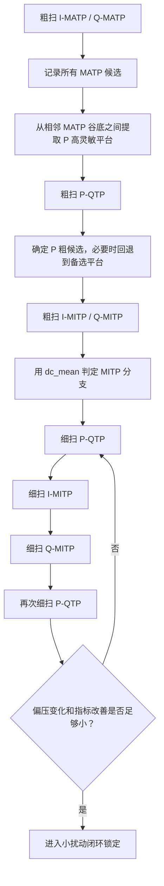

# Spec 06F - DPMZM 可行闭环偏压控制方案
> 状态：Design draft based on completed open-loop scan phase  
> 用途：把现有开环扫描结果整理成一套可落地的“自动寻优 + 局部闭环锁定”方案  
> 适用范围：当前 `DPMZM` 双导频、三偏压、板载连续导频实验路径  

---

## 1. 文档目标

这份文档回答的问题不是：

- 理论上 DPMZM 最优点应该长什么样

而是：

- 基于我们已经完成的开环扫描实验
- 如何设计一套**工程上可执行**的自动偏压寻优与闭环锁定流程

当前目标是把系统从：

- “人工看图、人工挑点、人工继续扫”

推进到：

- “板上自动粗捕获”
- “板上自动细化”
- “最后进入小扰动闭环锁定”

---

## 2. 当前共识与理论前提

这份方案基于以下三类结论：

1. 已有理论文档  
   - `docs/theoretical_knowledge/DPMZM_最小最小正交偏压控制方案_整理版.md`  
   - `docs/theoretical_knowledge/P路找正交点.md`

2. 已有开环实验文档  
   - `docs/scans/2026-04-23-dpmzm-open-loop-iteration.md`  
   - `docs/scans/2026-04-24-dpmzm-stage-summary.md`

3. 当前状态总览  
   - `docs/plan/spec-06d-dpmzm-status-overview.md`

当前已经明确：

- `MATP` 是相位参考锚点
- `QTP` 是真实交调最优点，不必等于理论 `90°`
- `MITP` 会因耦合与非理想项发生偏移
- `I / Q / P` 三路偏压强耦合，不能只扫一遍就结束

---

## 3. 三个必须先说清楚的概念

这是后续自动化设计里最容易混淆的地方。

### 3.1 “偏压最大点”不是我们要找的点

这里的“最大”绝不能理解成：

- 偏压值数值最大
- 例如 `+8 V` 比 `+2 V` 更“最大”

这种理解在控制方案里没有意义。

### 3.2 `MATP` 在当前工程语境里指的是一阶功率最低点

根据当前理论文档和实验实现，`I/Q` 路第一步寻找 `MATP`，统一按下面的工程定义理解：

- 扫描 `I` 路时，`fI` 一阶功率降到最低的点
- 扫描 `Q` 路时，`fQ` 一阶功率降到最低的点
- 也就是当前算法里要识别的**一阶局部极小值参考点**

因此工程上寻找 `MATP` 的方式是：

- 扫描 `I` 路时观察 `fI`
- 扫描 `Q` 路时观察 `fQ`
- 在曲线上找**局部极小值候选**
- 再结合对称性、周期位置等信息识别哪个点是 `MATP`

这里特别强调：

- `MATP` 不是“偏压数值最大点”
- 在这套工程表述里，也不直接把它解释成“传输功率最大点”
- 后续自动化实现里，应统一按“**一阶功率最低点参考锚点**”处理

### 3.3 `MATP` 本身不是 `P` 路最高灵敏度点

这点必须写死。

理论上，`P` 路交调主项满足：

```text
I_(fI±fQ) ∝ sin(phi_I / 2) * sin(phi_Q / 2) * cos(phi_P)
```

如果 `I/Q` 精确停在 `MATP`，则：

- `sin(phi_I / 2)` 或 `sin(phi_Q / 2)` 变得很小
- `P` 路交调响应会显著减弱
- 理想情况下甚至会进入 `P` 路盲区

所以：

- `MATP` 的作用是建立相位参考
- 不是直接作为 `P-QTP` 扫描工作点
- `P-QTP` 扫描应使用**相邻 `MATP` 谷底之间的一阶功率高平台**

这也是当前方案和之前口头表述最需要纠正的地方。

---

## 4. 方案总体结构

建议把整套控制流程拆成三个层次：

1. **粗捕获阶段**
   - 目标：从未知工作点进入可解释工作区

2. **局部细化阶段**
   - 目标：把 `I / Q / P` 收敛到一个强阶段性最优候选点

3. **真正闭环阶段**
   - 目标：在候选点附近持续锁定，抑制漂移

换句话说：

- 前两阶段更像“自动寻优”
- 第三阶段才是严格意义上的“闭环控制”

---

## 5. 推荐控制流程

## 5.1 第一步：粗扫 `I/Q-MATP`，建立参考锚点

### 目标

- 找到 `I` 路和 `Q` 路所有可信的 `MATP` 候选点
- 不是只保留一个点

### 输入

- 当前三路偏压未知或仅有粗初值
- 板载导频开启

### 执行动作

- `dpmzm scan matp i ...`
- `dpmzm scan matp q ...`

建议粗扫范围：

- 全范围，例如 `-9.0 ~ +9.0 V`
- 步进例如 `0.1 V`

### 候选点识别规则

扫描 `I` 路时：

- 找 `fI` 曲线的局部极小点
- 计算局部对称性
- 记录所有满足条件的 `MATP` 候选

扫描 `Q` 路时：

- 找 `fQ` 曲线的局部极小点
- 同样计算局部对称性

### 输出

每一路输出一个候选集，而不是单点：

- `I_MATP_candidates = {I1, I2, ...}`
- `Q_MATP_candidates = {Q1, Q2, ...}`

每个候选至少记录：

- `bias_v`
- `metric_f1`
- `symmetry_score`
- `dc_mean`
- `period_rank`
- `valid`

### 本步结论

这一步的目的不是“直接把系统偏在 MATP 上工作”，而是：

- 建立相位参考
- 给下一步构造 `P` 路灵敏邻域提供锚点

---

## 5.2 第二步：从 `MATP` 谷底之间提取 `P` 路高灵敏工作区

### 目标

- 不把 `I/Q` 停在精确 `MATP`
- 而是给 `P-QTP` 粗扫确定一个足够可靠的高灵敏初值

### 核心原则

粗扫阶段不追求把 `P` 路最佳灵敏区找得非常精确。

粗扫阶段真正要做的是：

- 先找到 `MATP` 参考谷底
- 再在相邻 `MATP` 谷底之间找到一阶功率最高的主平台
- 直接用这个主平台中心，作为 `P-QTP` 粗扫初值

也就是说，这一步先不做复杂候选集比较，只做：

- `选一个最合理的主平台中心`
- `如果后续 P 粗扫失败，再回退到备选平台`

### 为什么这样做

因为：

- 精确 `MATP` 有利于建立参考
- 但不利于观察 `P` 路交调

因此这一步本质是：

- `MATP` 负责定参考
- 相邻 `MATP` 谷底之间的一阶功率高平台负责提供 `P` 路灵敏度

### 当前工程理解

对单一路 `I` 或 `Q` 的 `MATP` 扫描曲线来说，通常会看到：

- 若干深谷底：对应 `MATP` 参考点
- 谷底之间的宽高平台：对应对 `P` 路更有利的高灵敏工作区

例如在 `I-MATP` 曲线中，如果两个深谷底大约位于：

- `I ≈ -3.4 V`
- `I ≈ +8.0 V`

而两谷之间的高平台大约位于：

- `I ≈ +1.8 ~ +2.1 V`

那么对 `P-QTP` 来说，更值得优先使用的是：

- `I ≈ +2.0 V` 附近的高平台

而不是：

- `I = -3.4 V`
- `I = +8.0 V`

### 推荐做法

对每一路 `MATP` 扫描结果，执行以下步骤：

1. 找到可信 `MATP` 谷底并按偏压从小到大排序
2. 取相邻两个 `MATP` 谷底构成一个区间
3. 在该区间内寻找一阶功率高平台
4. 记录该平台的：
   - `plateau_center_v`
   - `plateau_left_v`
   - `plateau_right_v`
   - `plateau_width_v`
   - `plateau_power_score`
5. 只保留一个主平台中心，作为该路的 `P` 粗扫初值
6. 只在 `P-QTP` 粗扫失败时，才切换到备选平台

对 `I` 路可得到：

- `I_sensitive_regions = {IR1, IR2, ...}`

对 `Q` 路可得到：

- `Q_sensitive_regions = {QR1, QR2, ...}`

粗扫阶段默认做法是：

- `I = I_main_plateau_center`
- `Q = Q_main_plateau_center`

只在第一次 `P-QTP` 粗扫没有扫出清晰谷底时，才启用：

- `I` 的备选平台中心
- `Q` 的备选平台中心

### 本步输出

- `I_sensitive_regions`
- `Q_sensitive_regions`
- `I_pqtp_coarse_init`
- `Q_pqtp_coarse_init`
- 可选的备选平台列表

---

## 5.3 第三步：粗扫 `P-QTP`

### 目标

- 在当前 `I/Q` 高灵敏初值下，粗找 `P` 路正交点候选

### 执行动作

- `dpmzm scan qtp p ...`

建议粗扫范围：

- 全范围，例如 `-9.0 ~ +9.0 V`
- 步进例如 `0.1 V`

### 判据

这一步当前建议只看一个量：

- 主判据：`mag_fsum_2200`

原因是：

- `200 Hz` 在当前实验中容易受到强低频干扰
- 它可以作为离线观察量保留
- 但不适合作为当前自动控制主链路的判据

### 候选点保留策略

不要只保留一个 `P` 点。

粗扫阶段至少保留：

- 最深 `2200 Hz` 谷底
- 次深 `2200 Hz` 谷底
- 谷底附近的局部窗口信息

### 本步真正想比较的东西

这一步粗扫阶段的目标不是“找最好看的 `P` 谷底组合”，而是：

- 先确认当前 `I/Q` 初值下，`2200 Hz` 的 `P-QTP` 曲线可用
- 并且能给出一个明确的 `P` 粗候选

如果当前主平台中心下：

- `2200 Hz` 曲线没有明显谷底
- 或曲线对比度太差

才回退到 `I/Q` 的备选平台中心重扫

### 本步输出

- `P_coarse_candidates`
- 当前可用的 `P_qtp_coarse_point`

---

## 5.4 第四步：粗扫 `I/Q-MITP`，并用 `DC` 判分支

### 目标

- 在 `P` 已大致落到 `QTP` 附近后
- 分别寻找 `I` 路和 `Q` 路的 `MITP`

### 执行动作

- `dpmzm scan mitp i ...`
- `dpmzm scan mitp q ...`

建议粗扫仍可使用：

- `-9.0 ~ +9.0 V`
- `0.1 V` 步进

### 关键问题

`MITP` 扫描中，往往会出现两个明显局部极小点。

这时不能只按“哪个更深”来选，而是要做分支判定。

### 当前推荐判定规则

对两个最强 `MITP` 候选，比较它们的 `dc_mean`：

- 若某候选能让 `dc_mean` 更小
- 则优先将该候选判为当前要的 `MITP`

### 注意

这里的 `DC` 判定建议使用：

- **同一次扫描内部的相对比较**

不建议使用：

- 跨实验绝对阈值比较

因为绝对 `DC` 会受光功率、增益、器件状态变化影响。

### 本步输出

- `I_MITP_candidates`
- `Q_MITP_candidates`
- 每个候选附带：
  - `bias_v`
  - `mag_f1`
  - `dc_mean`
  - `branch_rank`
  - `selected_as_mitp`

---

## 5.5 第五步：细扫 `P-QTP`

### 目标

- 在已有粗 `QTP` 点附近，缩小窗口做高分辨率重新定位

### 推荐窗口

例如粗扫得到：

- `P ≈ 1.2 V`

则细扫可设为：

- `0.6 ~ 1.8 V`
- 步进 `0.01 V`

也就是：

- 以粗候选为中心
- 左右各扫一段小窗口

### 判据

仍建议：

- 主看 `2200 Hz`

`200 Hz` 在当前阶段仍可保留为离线观察量，但不进入自动细扫主判据。

### 本步输出

- `P_fine_candidate`

---

## 5.6 第六步：细扫 `I/Q-MITP`

### 目标

- 在粗 `MITP` 附近做局部细化

### 推荐窗口

例如粗扫得到：

- `I ≈ 5.3 V`
- `Q ≈ -6.0 V`

则可设：

- `I`: `5.0 ~ 5.6 V`，步进 `0.01 V`
- `Q`: `-6.3 ~ -5.7 V`，步进 `0.01 V`

实际窗口宽度应结合前一轮谷底宽度自适应。

### 判据

仍然沿用粗扫逻辑：

- 先看一阶极小
- 再用 `dc_mean` 做同一扫描内分支比较

### 本步输出

- `I_fine_candidate`
- `Q_fine_candidate`

---

## 5.7 第七步：再次细扫 `P-QTP`

### 为什么要回扫 `P`

这是现有实验最重要的经验之一。

我们已经实测到：

- `P` 一改，`I/Q` 最优点会变
- `I/Q` 一改，`P-QTP` 也会再次轻微漂移

因此流程不能停在：

- `P 细扫一次`
- `I/Q 细扫一次`

而应该在 `I/Q` 细扫后：

- 再回扫一次 `P`

### 推荐策略

执行一个小循环：

1. 细扫 `P`
2. 细扫 `I`
3. 细扫 `Q`
4. 再细扫 `P`
5. 必要时再回 `I/Q`

### 停止条件

当以下条件同时满足时，可以结束自动寻优：

- `|ΔI| < 0.01 ~ 0.02 V`
- `|ΔQ| < 0.01 ~ 0.02 V`
- `|ΔP| < 0.01 ~ 0.02 V`
- 主指标改善幅度小于设定阈值，例如 `< 1 dB`

---

## 6. 真正闭环阶段：引入小扰动有符号误差

到这里为止，上述流程仍更接近：

- 自动寻优

还不是严格意义上的：

- 连续闭环锁定

要进入真正闭环，必须解决一个核心问题：

- 只知道“功率大/小”还不够
- 还必须知道“应该往左调还是往右调”

### 6.1 `P` 路闭环误差

在 `P` 的细化候选点附近加小扰动：

```text
P + δP
P - δP
```

定义目标函数 `J_P` 后，构造有符号误差：

```text
e_P = J_P(P + δP) - J_P(P - δP)
```

然后按：

```text
P_next = P_now - Kp * e_P
```

更新偏压。

### 6.2 `I/Q` 路闭环误差

同理：

```text
e_I = J_I(I + δI) - J_I(I - δI)
e_Q = J_Q(Q + δQ) - J_Q(Q - δQ)
```

其中：

- `J_I` 以 `fI` 为主
- `J_Q` 以 `fQ` 为主

### 6.3 目标函数建议

建议采用：

- `J_P`：以 `mag_fsum_2200` 为主
- `J_I`：以 `mag_fI` 为主，并保留 `dc_mean` 分支约束
- `J_Q`：以 `mag_fQ` 为主，并保留 `dc_mean` 分支约束

### 6.4 这一步为什么重要

只有引入这种小扰动比较后，系统才拥有：

- 大小信息
- 方向信息

也才真正具备“自动锁住而不是自动扫描”的能力。

---

## 7. 候选点记录格式建议

为了支持板上自动筛选，建议每个候选点统一记录如下字段：

| 字段 | 含义 |
|---|---|
| `stage` | `matp / qtp / mitp` |
| `target` | `i / q / p` |
| `bias_v` | 候选偏压值 |
| `metric_primary` | 主判据值 |
| `metric_secondary` | 辅判据值 |
| `dc_mean` | 直流均值 |
| `symmetry_score` | 局部对称性评分 |
| `contrast_score` | 曲线对比度评分 |
| `branch_id` | 所属分支编号 |
| `rank` | 当前阶段排序 |
| `valid` | 是否有效 |

对于 `MATP` 后续提取出的高灵敏平台，建议额外记录：

| 字段 | 含义 |
|---|---|
| `plateau_center_v` | 高平台中心电压 |
| `plateau_left_v` | 高平台左边界 |
| `plateau_right_v` | 高平台右边界 |
| `plateau_width_v` | 高平台宽度 |
| `plateau_power_score` | 平台一阶功率评分 |

对于 `P-QTP`，还可额外记录：

| 字段 | 含义 |
|---|---|
| `depth_2200` | `2200 Hz` 谷底深度 |
| `contrast_2200` | `2200 Hz` 曲线对比度 |
| `usable_for_control` | 是否适合进入当前控制主链 |

---

## 8. 当前方案与代码现状的映射关系

当前代码已经能直接支撑的部分：

- `I/Q MATP` 扫描
- `P QTP` 扫描
- `I/Q MITP` 扫描
- 固定工作点继续下一轮扫描
- 电脑端保存 CSV 与出图

当前还缺的能力：

- 板上自动候选点提取
- 板上对称性评分
- `DC` 分支自动判定
- `MATP` 高平台自动提取
- 局部迭代状态机
- 小扰动闭环环节

---

## 9. 推荐的第一版工程实现顺序

为了降低风险，建议按下面顺序推进，而不是一步写成“全自动终版”。

### 9.1 第一版：板上自动粗捕获

先实现：

- 自动扫 `I/Q MATP`
- 自动记录候选点
- 自动提取 `MATP` 谷底之间的高灵敏平台
- 自动扫 `P-QTP`

这一版的目标是：

- 不再手工到处抄点

### 9.2 第二版：板上自动细化

再实现：

- `MITP` 粗扫
- `DC` 判分支
- `P / I / Q` 小窗口细扫循环

这一版的目标是：

- 自动把工作点拉到阶段性最优候选附近

### 9.3 第三版：真正闭环

最后实现：

- 小扰动误差生成
- 有符号积分更新
- 长时间漂移抑制

这一版的目标是：

- 自动锁定

---

## 10. 当前推荐版本的流程图



---

## 11. 当前统一表述

基于现有理论与实验，当前更推荐采用如下统一表述：

> DPMZM 的自动偏压控制不应理解为“先找三个点，然后直接锁住”。更合理的工程路径是：先用 `I/Q-MATP` 找到一阶功率最低的参考谷底，再从相邻 `MATP` 谷底之间提取一阶功率高平台，把它作为 `P` 路交调最敏感的工作区，随后依次完成 `P-QTP`、`I-MITP`、`Q-MITP` 的粗捕获与细化收敛，最后在阶段性最优候选点附近引入小扰动有符号误差，实现真正闭环。

---

## 12. 当前最重要的纠正结论

最后把最关键的一句单独写出来，避免后续再次混淆：

**第一步里不能再把 `MATP` 简单口头说成“最大点”。在当前工程语境里，`MATP` 指的是 `I/Q` 一阶功率降到最低的参考谷底，不是偏压数值最大点。并且 `MATP` 本身只承担相位参考锚点作用，不能直接拿来作为 `P` 路最高灵敏度工作点；`P` 路真正的高灵敏工作区应来自相邻 `MATP` 谷底之间的一阶功率高平台。**
