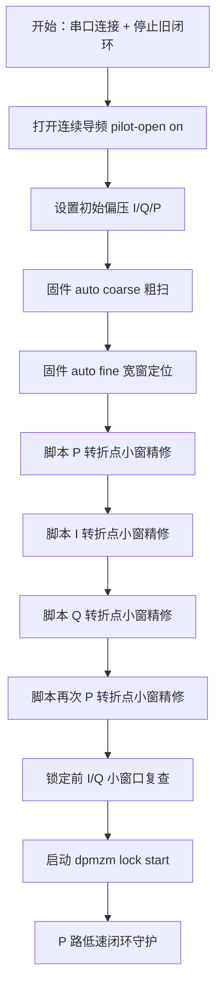

# Spec 06J - DPMZM 找点与闭环控制完整流程（PPT 版）

> 状态：当前自动找点 + 低速闭环控制流程总结  
> 日期：2026-05-07  
> 用途：用于制作 PPT，说明我们现在如何从未知偏压出发，自动找到 DPMZM 最小最小正交点，并进入闭环控制。

---

## 1. 一句话总结

当前流程分成两层：

- 固件负责：连续导频、偏压输出、ADC 采集、Goertzel 频点提取、粗扫、宽窗细扫、闭环 probe/step。
- 电脑脚本负责：串口编排、保存原始日志、解析扫描结果、转折点小窗精修、锁定前 I/Q 复查、启动闭环。

最终目标不是“单次扫出一个数学最小值”，而是：

```text
先可靠找到一组接近最小最小正交点的 I/Q/P 偏压，
再用低速闭环在该点附近持续守住 P-QTP，
必要时通过 I/Q 锚点复查避免载波抑制点漂走。
```

---

## 2. 当前使用的三个主指标

| 控制对象 | 扫描类型 | 主频点 | 判断目标 |
|---|---|---:|---|
| I 路 | I-MATP / I-MITP | 1000 Hz | I 路一阶功率尽量低 |
| Q 路 | Q-MATP / Q-MITP | 1200 Hz | Q 路一阶功率尽量低 |
| P 路 | P-QTP | 2200 Hz = fI + fQ | I/Q 交调和频项尽量低 |

当前不把 `200 Hz = |fI-fQ|` 作为主判断量。

原因：

- 实验中 200 Hz 明显更容易受到低频干扰。
- P 路正交点用 2200 Hz 判断，和光功率计、光谱仪观察更一致。
- 第一版稳定控制优先追求可靠，不把低频干扰引入主闭环。

---

## 3. 总体流程图



---

## 4. 上电与脚本准备阶段

脚本入口：

```powershell
python tools\run_dpmzm_positive_branch_flow.py --port COM8
```

脚本启动后先做这些事情：

1. 发送 `dpmzm lock stop`，避免旧闭环状态影响本轮找点。
2. 发送 `dpmzm set dump metrics`，确保串口输出 `DPMZMCSV` 指标数据。
3. 发送 `dpmzm set pilot-open on`，确保导频常开。
4. 默认把 I/Q/P 设置到初始值，通常是 `0 V / 0 V / 0 V`。
5. 保存串口日志、进度日志和解析后的 metrics CSV。

重要经验：

- 扫描和原始采集前必须确保导频已经打开。
- 现在脚本会主动打开导频，但实验时仍建议用示波器或频谱仪确认 1 kHz / 1.2 kHz 确实存在。

---

## 5. 第一阶段：auto coarse 粗扫

固件命令：

```text
dpmzm auto coarse
```

当前参数：

| 项目 | 数值 |
|---|---:|
| 扫描范围 | -9 V 到 +9 V |
| 扫描步进 | 0.5 V |
| I/Q blocks | 4 |
| P blocks | 10 |

### 5.1 I-MATP 粗扫

动作：

```text
dpmzm scan matp i -9 9 0.5 4
```

目标：

- 扫描 I 路偏压。
- 观察 1000 Hz 一阶功率曲线。
- 找到 I-MATP 谷底候选点。

候选点处理：

- 不允许扫描边缘点直接作为候选点。
- 使用局部极小值和邻域平滑指标，避免单点毛刺。
- MATP 谷底之间的平台区域用于给 P-QTP 提供高灵敏度初始 I 偏压。

### 5.2 Q-MATP 粗扫

动作：

```text
dpmzm scan matp q -9 9 0.5 4
```

目标：

- 扫描 Q 路偏压。
- 观察 1200 Hz 一阶功率曲线。
- 找到 Q-MATP 谷底候选点。

候选点处理和 I-MATP 相同。

### 5.3 从 MATP 提取 P 路初始高灵敏区

这里不是直接把 MATP 谷底作为 P 路工作点。

真正做法是：

```text
从相邻 MATP 谷底之间寻找一段一阶功率较高、较平坦的平台区，
取平台中心作为 P-QTP 粗扫时的 I/Q 初始偏压。
```

直观理解：

- MATP 谷底本身是一阶消光点。
- 谷底之间的平台区对应 I/Q 对 P 路交调更敏感的区域。
- P-QTP 要在这个高灵敏区域里找，曲线才更容易出现清晰谷底。

当前固件实际有三种平台提取路径：

1. 标准路径：如果能找到两个相邻 MATP 谷底，就在两个谷底之间找一阶功率最高的平台峰值，并从峰值左右扩展到功率下降超过约 `1 dB` 的位置，最后取平台中心。
2. 虚拟边界路径：如果只找到一个显式 MATP 谷底，但扫描边界附近呈现“边缘低、向内一阶功率明显升高”的趋势，固件会把该边界当作一个“被扫描范围截断的虚拟谷底 anchor”，再和真实 MATP 谷底组成区间。
3. 退化路径：如果有效 anchor 仍不足两个，固件会避开已知 MATP 谷底附近区域，直接在剩余区域寻找一阶功率最高点；这对应实验上看到的“一阶功率先增大后减小”的平台趋势。

因此 PPT 里可以这样讲：

```text
优先用两个 MATP 谷底夹出高灵敏平台；
如果只看到一个谷底，则允许用扫描边界的截断谷底作为虚拟 anchor；
如果谷底结构仍不完整，则用“一阶功率先升后降”的趋势寻找平台峰值。
```

### 5.4 P-QTP 粗扫

动作：

```text
dpmzm scan qtp p -9 9 0.5 10
```

目标：

- 固定前面得到的 I/Q 平台中心。
- 扫描 P 路偏压。
- 以 2200 Hz = fI + fQ 为主指标，寻找 P-QTP 谷底。

保护逻辑：

- QTP 曲线动态范围至少要够大，否则认为这轮 P-QTP 不可信。
- 过滤扫描边缘点，避免第一个点或最后一个点异常抢走候选。
- 过滤单点深跌毛刺，避免 ADC/settle 噪声点被误判为正交点。
- 当正支路和负支路差别不大时，可以优先选择正支路；但物理上正负 QTP 都可能是真实正交点。

### 5.5 I-MITP / Q-MITP 粗扫

动作：

```text
dpmzm scan mitp i -9 9 0.5 4
dpmzm scan mitp q -9 9 0.5 4
```

目标：

- 在 P-QTP 粗扫结果附近，重新寻找 I/Q 的最小传输点。
- I 路看 1000 Hz，Q 路看 1200 Hz。

MITP 分支选择逻辑：

```text
先找一阶功率足够低的候选点；
再在“功率接近最优”的候选点里，优先选择 DC 更低的点。
```

当前规则：

- 先找 MITP 局部谷底候选。
- 找到所有候选中一阶功率最低的点。
- 对于功率不比最低点差超过约 3 dB 的候选，认为它们同样有资格。
- 在这些候选里选 DC 更低的点。

这个逻辑的动机：

- 单看一阶功率，可能会选到错误分支。
- 单看 DC，也可能选到一阶没有真正压低的点。
- 所以现在采用“一阶足够低 + DC 更低”的综合判断。

---

## 6. 第二阶段：auto fine 宽窗定位

固件命令：

```text
dpmzm auto fine
```

当前参数：

| 项目 | 数值 |
|---|---:|
| 宽窗范围 | center ±2.0 V |
| 宽窗步进 | 0.2 V |
| I/Q blocks | 4 |
| P blocks | 10 |

当前 `auto fine` 的定位是“宽窗定位”，不是最终 0.01 V 精扫。

执行顺序：

1. 固定 I/Q，围绕 P-QTP coarse 做 P-QTP 宽窗扫描。
2. 固定 Q/P，围绕 I-MITP coarse 做 I-MITP 宽窗扫描。
3. 固定 I/P，围绕 Q-MITP coarse 做 Q-MITP 宽窗扫描。

为什么不在固件里做完整 0.01 V 全细扫：

- 全细扫耗时太长。
- P 路可能被全局深谷吸到另一条分支。
- 目前更可靠的做法是：固件只给出较好的 seed，最后由脚本做局部转折点搜索。

---

## 7. 第三阶段：脚本转折点小窗精修

脚本在 `auto fine` 之后接管精修。

当前默认参数：

| 项目 | I/Q | P |
|---|---:|---:|
| blocks | 4 | 6 |
| 转折探测步长 | 0.10 V | 0.10 V |
| 最终小窗半宽 | 0.10 V | 0.10 V |
| 最终小窗步进 | 0.01 V | 0.01 V |

精修顺序：

```text
P-turn -> I-turn -> Q-turn -> P-turn
```

### 7.1 转折点搜索逻辑

对某一路偏压中心 `center`，脚本先扫三个点：

```text
center - 0.10 V
center
center + 0.10 V
```

判断：

```text
如果 center 已经比左右两侧都低：
    说明谷底被夹住，进入 0.01 V 小窗精扫

如果左侧更低：
    center 向左移动 0.10 V，继续探测

如果右侧更低：
    center 向右移动 0.10 V，继续探测
```

这样做的好处：

- 不需要每次都扫很大的细窗。
- 如果点已经在斜坡上，脚本会沿着下降方向移动。
- 找到谷底附近后，再用 0.01 V 精扫提高最终精度。

### 7.2 为什么 P 要扫两次

P-QTP 会受到 I/Q 工作点变化影响。

因此脚本流程是：

1. 先用 P-turn 把 P 路拉到一个较好的 QTP。
2. 再分别精修 I-MITP 和 Q-MITP。
3. I/Q 变化后，P-QTP 可能轻微移动，所以最后再做一次 P-turn。

---

## 8. 第四阶段：锁定前 I/Q 小窗口复查

在启动闭环前，脚本会再做一次 I/Q 小窗口复查。

当前参数：

| 项目 | 数值 |
|---|---:|
| I/Q 复查窗口 | center ±0.08 V |
| 步进 | 0.01 V |
| blocks | 4 |

目的：

- 确认 I/Q 的 MITP 谷底没有落在窗口边缘。
- 避免还没进入闭环时，I/Q 就已经偏离载波抑制锚点。
- 这一步是为了减少“刚锁定就已经锁错点”的概率。

---

## 9. 第五阶段：闭环控制

固件命令：

```text
dpmzm lock start
```

当前闭环策略：

```text
P 路连续低速闭环；
I/Q 路不连续微调，只作为锚点被复查。
```

也就是说，当前固件的闭环序列是：

```text
P -> P -> P -> ...
```

这样做的原因：

- P-QTP 是正交点，短时间内最需要连续守护。
- I/Q 是 MITP 锚点，如果连续跟噪声小步跑，容易把载波抑制点带偏。
- 实验中已经观察到 I/Q 连续乱动会影响光谱载波抑制，因此当前先保守处理。

### 9.1 P 路闭环 probe 方法

每次闭环 step 会测三个点：

```text
P_plus  = P + delta
P_minus = P - delta
P0      = P
```

然后比较 2200 Hz 指标。

当前默认参数：

| 参数 | 数值 |
|---|---:|
| delta | 0.05 V |
| gain | 0.003 V |
| max step | 0.003 V |
| deadband | 0.03 |
| blocks | 10 |
| settle | 10 ms |
| loop interval | 500 ms |

判断规则：

```text
如果中心点已经比左右两侧都好：
    hold-center，不移动

如果左右两侧改善不明显：
    hold-weak，不移动

如果某一侧明显更好：
    朝更好的方向移动一个很小的步长
```

这不是高速 PID，而是“低速、小步、带死区”的稳定守护。

### 9.2 为什么暂时不用连续 I/Q 闭环

当前 I/Q 的作用是锚点，不是快速控制对象。

原因：

- I/Q MITP 谷底很尖，噪声和测量误差可能导致方向判断抖动。
- 连续小步移动 I/Q 可能让载波抑制点慢慢漂走。
- 当前更安全的策略是：I/Q 只在有证据偏移时做触发式小窗复查。

---

## 10. 当前完整命令链路

固件内部命令链路：

```text
dpmzm lock stop
dpmzm set dump metrics
dpmzm set pilot-open on
dpmzm set bias i 0
dpmzm set bias q 0
dpmzm set bias p 0
dpmzm auto coarse
dpmzm auto fine
dpmzm lock start
```

实际实验建议使用脚本统一执行：

```powershell
python tools\run_dpmzm_positive_branch_flow.py --port COM8
```

脚本会额外完成：

- 保存完整串口原始日志。
- 保存 `DPMZMCSV` 解析后的 metrics CSV。
- 执行 P/I/Q/P 转折点小窗精修。
- 执行锁定前 I/Q 复查。
- 最后启动闭环控制。

---

## 11. 输出文件与画图

每轮脚本运行会生成：

```text
raw data/<timestamp>_dpmzm_positive_branch_flow_serial.log
raw data/<timestamp>_dpmzm_positive_branch_flow_progress.log
raw data/<timestamp>_dpmzm_positive_branch_flow_metrics.csv
```

这些文件用于：

- 复盘每个扫描阶段。
- 画出每一段扫描曲线。
- 检查候选点是否符合人眼判断。
- 分析闭环前后的点位是否漂移。

---

## 12. 当前流程的核心优点

1. 粗扫快：`step=0.5 V`，可以快速找到大致分支。
2. 细扫稳：不再做大范围 0.01 V 全扫，而是转折点定位后小窗精扫。
3. 指标清楚：I 看 1000 Hz，Q 看 1200 Hz，P 看 2200 Hz。
4. 候选更可靠：P 路过滤边缘点和单点毛刺，I/Q MITP 引入 DC 辅助选择。
5. 闭环保守：当前只连续守护 P，避免 I/Q 被噪声拖走。

---

## 13. 当前仍要注意的问题

### 13.1 找点质量仍依赖导频与采样链路

如果导频没有真正输出，或者频点不对，所有曲线都会变小、变抖、变不可信。

实验前建议确认：

- 1 kHz 导频存在。
- 1.2 kHz 导频存在。
- raw FFT 中主峰位置与频谱仪/示波器一致。

### 13.2 P 路可能存在多条 QTP 分支

P-QTP 可能有正负两个真实正交点。

当前流程重点是找到一条稳定可用的分支，而不是证明只有一个正交点。

### 13.3 不同调制器需要重新验证候选选择

换调制器后，MATP/MITP/QTP 曲线形状会变。

因此当前新增了：

- 边缘点剔除。
- P 路毛刺剔除。
- I/Q MITP 候选按“一阶低 + DC 低”综合选择。

后续仍需要用不同调制器继续验证鲁棒性。

---

## 14. PPT 推荐结构

建议 PPT 可以按下面 8 页展开：

1. 目标：DPMZM 最小最小正交点自动找点与守护。
2. 指标：I=1000 Hz，Q=1200 Hz，P=2200 Hz。
3. 总流程图：粗扫 -> 宽窗 -> 转折精修 -> I/Q 复查 -> P 闭环。
4. 粗扫：MATP 找平台，P-QTP 找正交，MITP 找 I/Q 消光。
5. 细扫：转折点搜索如何减少扫描时间。
6. 候选保护：边缘点、毛刺、DC 辅助选择。
7. 闭环：P 路 probe/step 低速守护，I/Q 锚点复查。
8. 当前结论与后续：流程已跑通，下一步优化稳定性和跨调制器鲁棒性。

---

## 15. 对应代码入口

| 功能 | 文件 |
|---|---|
| PC 端完整流程脚本 | `tools/run_dpmzm_positive_branch_flow.py` |
| 自动粗扫 / 宽窗细扫 | `control/src/ctrl_auto_dpmzm.c` |
| 闭环 probe / step / status | `control/src/ctrl_lock_dpmzm.c` |
| 串口命令入口 | `app/src/app_main_dpmzm.c` |
| 扫描与测量 | `control/src/ctrl_scan_dpmzm.c`, `control/src/ctrl_measure_dpmzm.c` |
