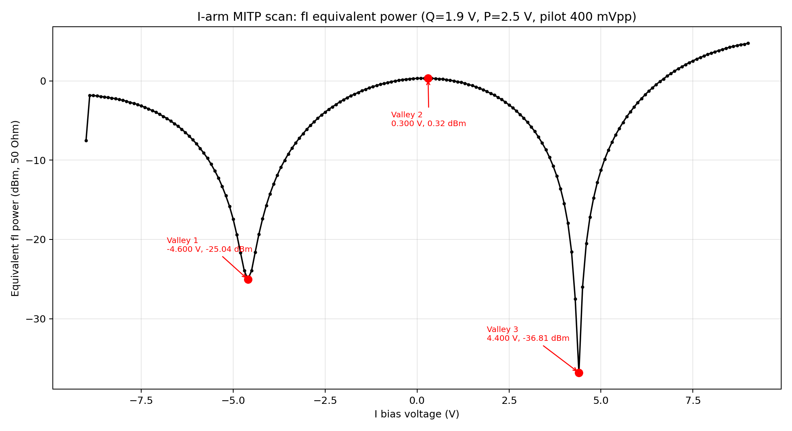
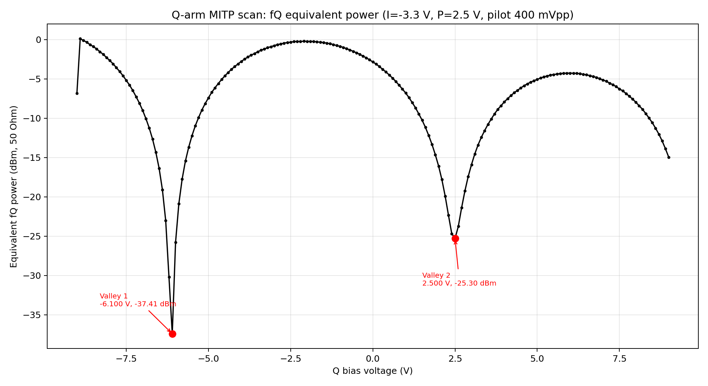
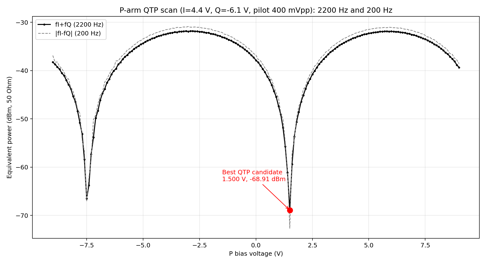
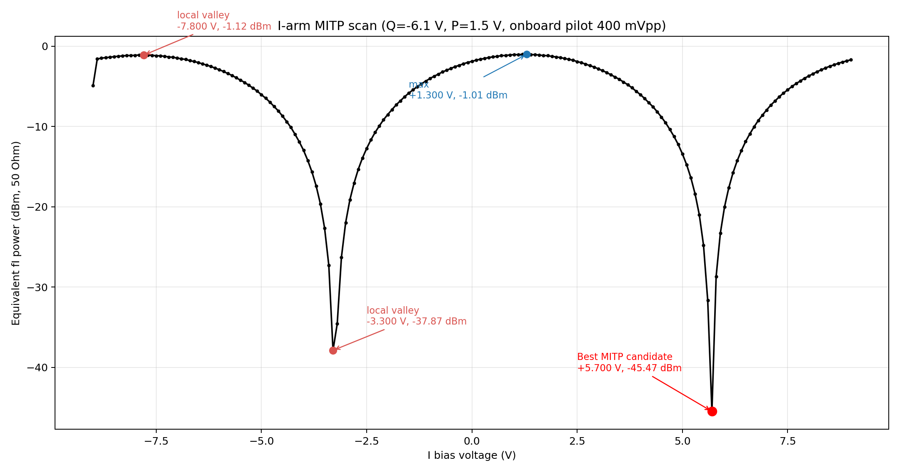
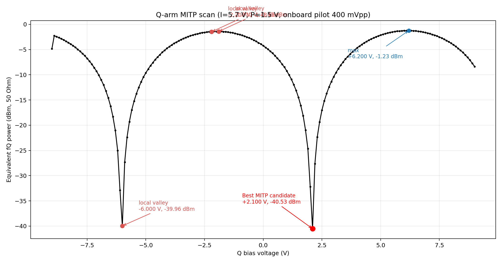
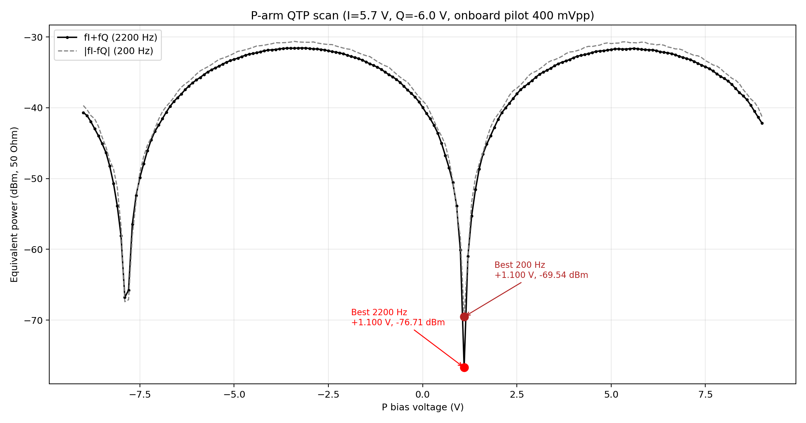
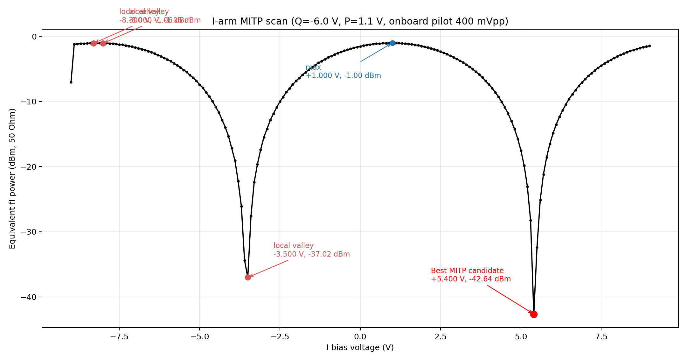
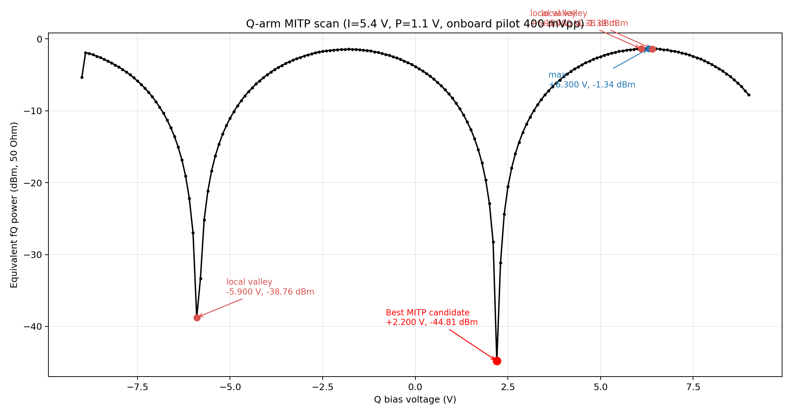
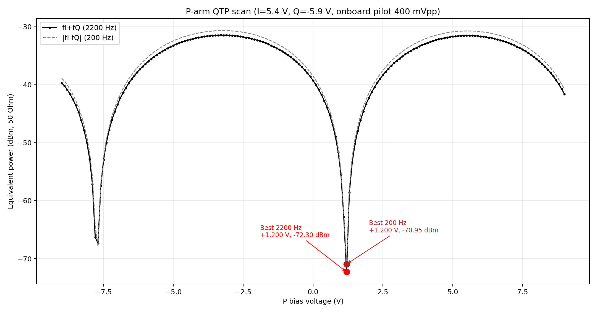

# 2026-04-23 DPMZM 开环迭代扫描记录

本文档记录 2026-04-23 在修复 ADC 采样率 / 导频频率不匹配问题之后，进行的一轮 DPMZM 开环偏压迭代扫描。实验目标是利用板载连续导频，依次寻找 I 路 MITP、Q 路 MITP 和 P 路 QTP 工作点，并观察三路偏压之间的耦合关系。

## 实验条件

| 项目 | 数值 / 状态 |
|---|---|
| 固件模式 | DPMZM 开环扫描 |
| 导频来源 | 板载 onboard |
| 导频输出方式 | 连续输出 continuous |
| I 路导频 | 1000 Hz, 400 mVpp |
| Q 路导频 | 1200 Hz, 400 mVpp |
| 固件状态中显示的 TIM6 更新率 | 16000.00 Hz |
| 串口 | COM9, 115200 baud |
| 数据输出模式 | metrics |
| 扫描范围 | -9.0 V 到 +9.0 V |
| 扫描步进 | 0.1 V |
| 每点平均块数 | 6 |
| 固件扫描逻辑 | 切换偏压后等待 settle，丢弃 1 个 Goertzel block，再对指定 block 数做平均 |

## 本轮扫描使用的判据

| 扫描命令 | 固定通道 | 扫描通道 | 主要观察量 |
|---|---|---|---|
| `dpmzm scan mitp i -9.0 9.0 0.1 6` | Q, P | I | `mag_fI`, 1000 Hz |
| `dpmzm scan mitp q -9.0 9.0 0.1 6` | I, P | Q | `mag_fQ`, 1200 Hz |
| `dpmzm scan qtp p -9.0 9.0 0.1 6` | I, Q | P | `mag_fsum_2200`, 同时参考 `mag_fdiff_200` |

文中所有功率值均由固件输出的峰值幅度换算为 50 欧姆等效 dBm：

```text
Vrms = Vpeak / sqrt(2)
P(dBm) = 10 * log10((Vrms^2 / 50) * 1000)
```

## 迭代过程总览

| 步骤 | 扫描前施加条件 | 命令 | 主要结果 | 备注 |
|---|---|---|---|---|
| 1 | I=+2.1 V, Q=-3.2 V, 导频 400 mVpp | `dpmzm scan qtp p -9.0 9.0 0.1 6` | 综合候选点约在 P=+2.7 V；2200 Hz 局部最小也出现在 P=-6.0 V 附近 | 早期 P-QTP 探索；此时 200 Hz 和 2200 Hz 还没有很好地在同一点收敛。 |
| 2 | Q=+1.9 V, P=+2.5 V | `dpmzm scan mitp i -9.0 9.0 0.1 6` | I=+4.4 V, fI=-36.81 dBm | 得到第一个可用的 I 路 MITP 候选点。 |
| 3 | I=-3.3 V, P=+2.5 V | `dpmzm scan mitp q -9.0 9.0 0.1 6` | Q=-6.1 V, fQ=-37.41 dBm | 得到第一个可用的 Q 路负分支 MITP 候选点。 |
| 4 | I=+4.4 V, Q=-6.1 V | `dpmzm scan qtp p -9.0 9.0 0.1 6` | P=+1.5 V；2200 Hz=-68.91 dBm，200 Hz=-72.67 dBm | 200 Hz 和 2200 Hz 在同一个 P 点同时压低，说明 P-QTP 扫描路径已经比较可信。 |
| 5 | Q=-6.1 V, P=+1.5 V | `dpmzm scan mitp i -9.0 9.0 0.1 6` | I=+5.7 V, fI=-45.47 dBm | P 点更新后，I 路 MITP 候选点从 +4.4 V 移到 +5.7 V。 |
| 6 | I=+5.7 V, P=+1.5 V | `dpmzm scan mitp q -9.0 9.0 0.1 6` | Q=+2.1 V, fQ=-40.53 dBm | 在该 I/P 条件下，Q-MITP 更倾向正电压分支。 |
| 7 | I=+5.7 V, Q=-6.0 V | `dpmzm scan qtp p -9.0 9.0 0.1 6` | P=+1.1 V；2200 Hz=-76.71 dBm，200 Hz=-69.54 dBm | 继续沿 Q 负分支扫描，P-QTP 谷底非常深且干净。 |
| 8 | Q=-6.0 V, P=+1.1 V | `dpmzm scan mitp i -9.0 9.0 0.1 6` | I=+5.4 V, fI=-42.64 dBm | P 从 +1.5 V 调到 +1.1 V 后，I 候选点从 +5.7 V 微调到 +5.4 V。 |
| 9 | I=+5.4 V, P=+1.1 V | `dpmzm scan mitp q -9.0 9.0 0.1 6` | Q=+2.2 V, fQ=-44.81 dBm | Q-MITP 再次更倾向正分支；此时 Q=-6.0 V 处只有 -26.97 dBm。 |
| 10 | I=+5.4 V, Q=-5.9 V | `dpmzm scan qtp p -9.0 9.0 0.1 6` | P=+1.2 V；2200 Hz=-72.30 dBm，200 Hz=-70.95 dBm | 本轮最后一次沿 Q 负分支的 P-QTP 扫描。 |

## 关键观察

| 现象 | 解释 / 判断 |
|---|---|
| 使用连续板载导频，并修复采样率 / 导频频率匹配问题后，P-QTP 曲线明显变干净。 | 之前 raw FFT 峰值和固件 Goertzel 目标频点不一致，确实是导致扫描曲线异常的重要原因。 |
| 在 I=+4.4 V, Q=-6.1 V 条件下，P-QTP 给出 P=+1.5 V。 | 这是第一次较明确地看到 200 Hz 和 2200 Hz 在同一个 P 点同时压低。 |
| P 从 +1.5 V 改到 +1.1 V 后，I-MITP 从 +5.7 V 移到 +5.4 V。 | I/Q/P 三路明显耦合，不能认为三路偏压可以完全独立一次扫完。 |
| 后期 Q-MITP 两次都更倾向 Q=+2.1 V 到 +2.2 V 的正分支。 | 这和我们沿 Q 负分支做 P-QTP 的路线还没有完全统一，需要后续专门比较正 / 负 Q 分支。 |
| 本轮沿 Q 负分支得到的阶段性工作点约为 I=+5.4 V, Q=-5.9 V, P=+1.2 V。 | 在最后一次 P-QTP 扫描中，这个点能同时压低 200 Hz 和 2200 Hz 两个交调项。 |

## 结果图片与数据

### 步骤 2：I-MITP，Q=+1.9 V，P=+2.5 V

结果：I=+4.4 V，fI=-36.81 dBm。

CSV：[2026-04-23_172304_Sweep_I_MITP_Q1p9_P2p5_step0p1_discard1block_afterTim6RateFix_metrics.csv](../../../raw_data/2026-04-23_172304_Sweep_I_MITP_Q1p9_P2p5_step0p1_discard1block_afterTim6RateFix_metrics.csv)



### 步骤 3：Q-MITP，I=-3.3 V，P=+2.5 V

结果：Q=-6.1 V，fQ=-37.41 dBm。

CSV：[2026-04-23_173302_Sweep_Q_MITP_I-3p3_P2p5_step0p1_discard1block_afterTim6RateFix_metrics.csv](../../../raw_data/2026-04-23_173302_Sweep_Q_MITP_I-3p3_P2p5_step0p1_discard1block_afterTim6RateFix_metrics.csv)



### 步骤 4：P-QTP，I=+4.4 V，Q=-6.1 V

结果：P=+1.5 V，2200 Hz=-68.91 dBm，200 Hz=-72.67 dBm。

CSV：[2026-04-23_174049_Sweep_P_QTP_I4p4_Q-6p1_400mVpp_step0p1_discard1block_afterTim6RateFix_metrics.csv](../../../raw_data/2026-04-23_174049_Sweep_P_QTP_I4p4_Q-6p1_400mVpp_step0p1_discard1block_afterTim6RateFix_metrics.csv)



### 步骤 5：I-MITP，Q=-6.1 V，P=+1.5 V

结果：I=+5.7 V，fI=-45.47 dBm。

CSV：[2026-04-23_174853_Sweep_I_MITP_Qunchanged_P1p5_400mVpp_step0p1_discard1block_afterTim6RateFix_metrics.csv](../../../raw_data/2026-04-23_174853_Sweep_I_MITP_Qunchanged_P1p5_400mVpp_step0p1_discard1block_afterTim6RateFix_metrics.csv)



### 步骤 6：Q-MITP，I=+5.7 V，P=+1.5 V

结果：Q=+2.1 V，fQ=-40.53 dBm。

CSV：[2026-04-23_175634_Sweep_Q_MITP_I5p7_Punchanged_400mVpp_step0p1_discard1block_afterTim6RateFix_metrics.csv](../../../raw_data/2026-04-23_175634_Sweep_Q_MITP_I5p7_Punchanged_400mVpp_step0p1_discard1block_afterTim6RateFix_metrics.csv)



### 步骤 7：P-QTP，I=+5.7 V，Q=-6.0 V

结果：P=+1.1 V，2200 Hz=-76.71 dBm，200 Hz=-69.54 dBm。

CSV：[2026-04-23_180043_Sweep_P_QTP_I5p7_Q-6p0_400mVpp_step0p1_discard1block_afterTim6RateFix_metrics.csv](../../../raw_data/2026-04-23_180043_Sweep_P_QTP_I5p7_Q-6p0_400mVpp_step0p1_discard1block_afterTim6RateFix_metrics.csv)



### 步骤 8：I-MITP，Q=-6.0 V，P=+1.1 V

结果：I=+5.4 V，fI=-42.64 dBm。

CSV：[2026-04-23_180458_Sweep_I_MITP_Q-6p0_P1p1_400mVpp_step0p1_discard1block_afterTim6RateFix_metrics.csv](../../../raw_data/2026-04-23_180458_Sweep_I_MITP_Q-6p0_P1p1_400mVpp_step0p1_discard1block_afterTim6RateFix_metrics.csv)



### 步骤 9：Q-MITP，I=+5.4 V，P=+1.1 V

结果：Q=+2.2 V，fQ=-44.81 dBm。

CSV：[2026-04-23_180956_Sweep_Q_MITP_I5p4_P1p1_400mVpp_step0p1_discard1block_afterTim6RateFix_metrics.csv](../../../raw_data/2026-04-23_180956_Sweep_Q_MITP_I5p4_P1p1_400mVpp_step0p1_discard1block_afterTim6RateFix_metrics.csv)



### 步骤 10：最终 P-QTP，I=+5.4 V，Q=-5.9 V

结果：P=+1.2 V，2200 Hz=-72.30 dBm，200 Hz=-70.95 dBm。

CSV：[2026-04-23_181443_Sweep_P_QTP_I5p4_Q-5p9_400mVpp_step0p1_discard1block_afterTim6RateFix_metrics.csv](../../../raw_data/2026-04-23_181443_Sweep_P_QTP_I5p4_Q-5p9_400mVpp_step0p1_discard1block_afterTim6RateFix_metrics.csv)



## 当前工作点候选

| 分支 | I 候选点 | Q 候选点 | P 候选点 | 依据 |
|---|---:|---:|---:|---|
| 本轮最终沿用的 Q 负分支 | +5.4 V | -5.9 V 到 -6.0 V | +1.1 V 到 +1.2 V | 最后一次 P-QTP 在 P=+1.2 V 处得到 2200 Hz=-72.30 dBm、200 Hz=-70.95 dBm。 |
| Q-MITP 提示的 Q 正分支 | +5.4 V 到 +5.7 V | +2.1 V 到 +2.2 V | 尚未重新扫描 | Q-MITP 在 Q=+2.1 V 得到 fQ=-40.53 dBm，在 Q=+2.2 V 得到 fQ=-44.81 dBm。 |

## 后续建议检查

| 优先级 | 检查内容 | 原因 |
|---|---|---|
| 高 | 设置 I=+5.4 V、Q=-5.9 V、P=+1.2 V，采集原始 ADC 波形并做 FFT。 | 验证最终 Q 负分支候选点在原始频谱中也能压低两个交调项，而不只是 Goertzel metrics 上表现好。 |
| 高 | 在 I=+5.4 V、Q=+2.2 V 条件下重新执行 `dpmzm scan qtp p -9.0 9.0 0.1 6`。 | 判断 Q-MITP 指向的 Q 正分支是否比当前 Q 负分支更优。 |
| 中 | 围绕 P=+1.2 V 做更窄范围、更小步进扫描，例如 0.02 V。 | 在 0.1 V 粗扫基础上进一步细化 P-QTP 点。 |
| 中 | 围绕 I=+5.4 V 以及最终选定的 Q 分支做更窄范围扫描。 | 减小 0.1 V 粗扫带来的残余误差。 |
