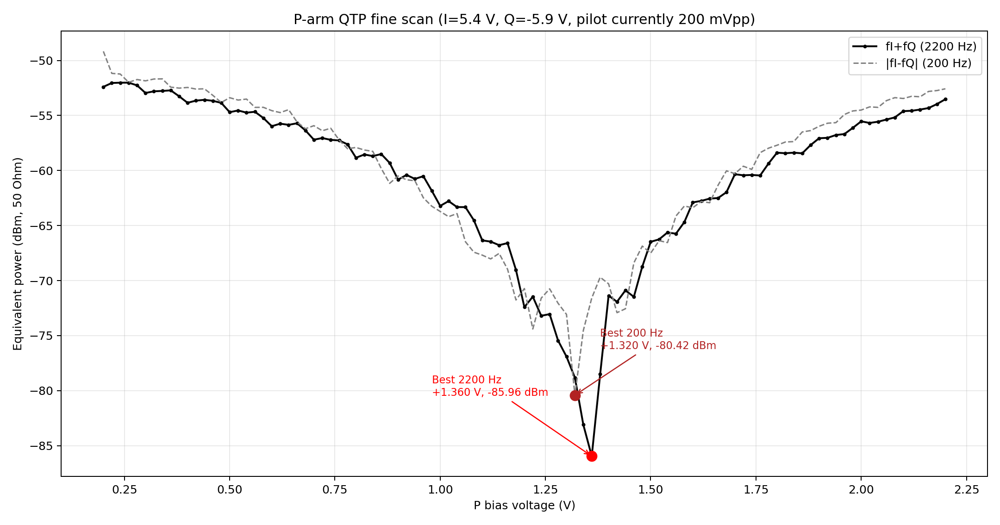
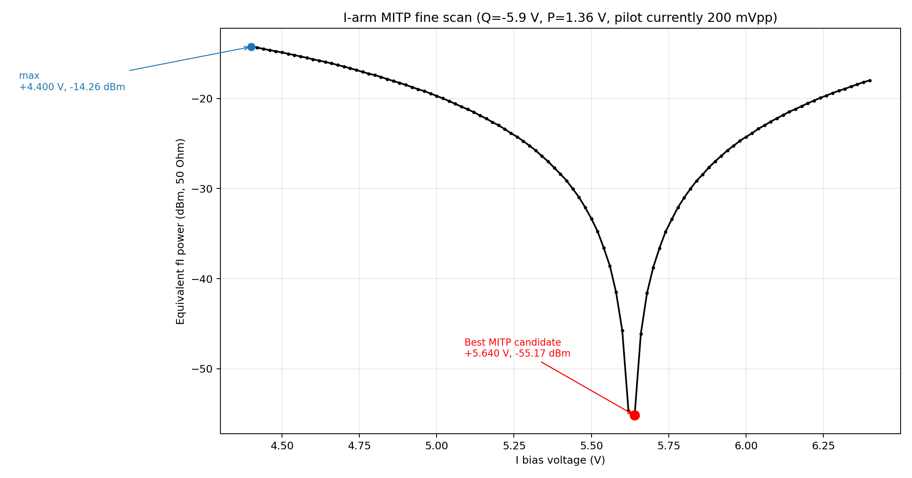
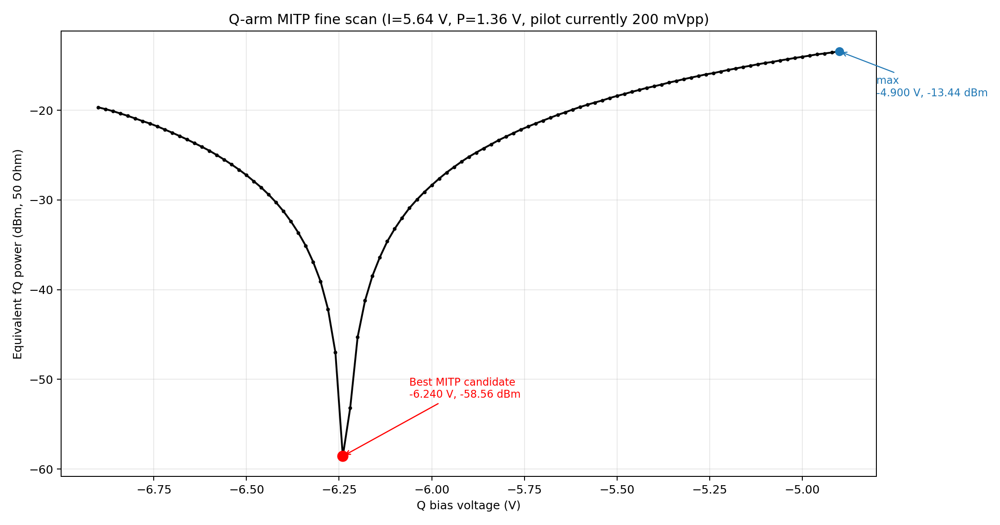
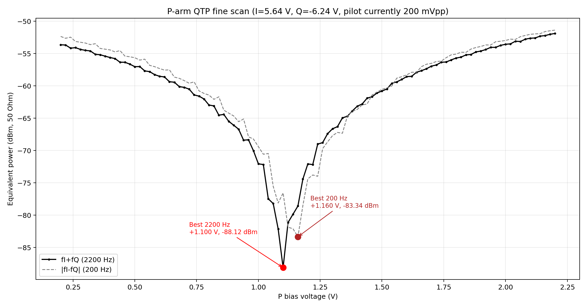
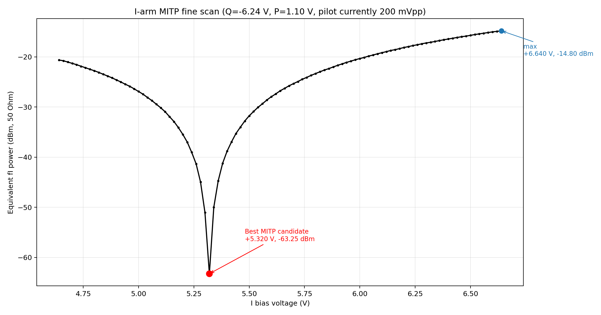
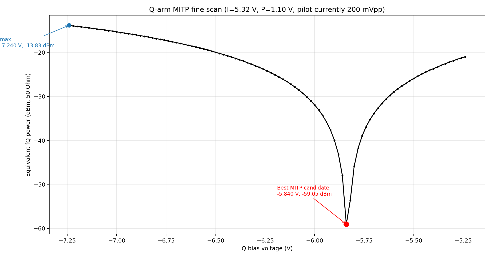
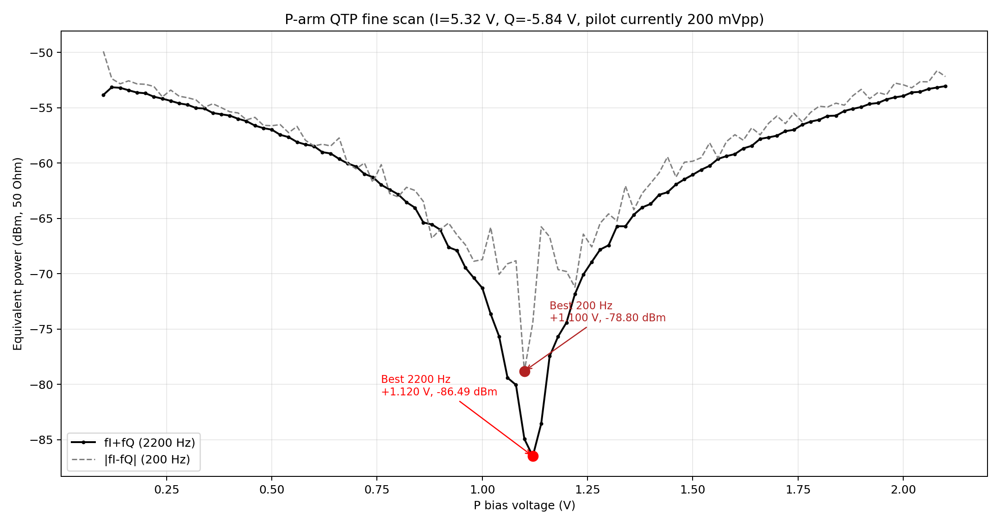
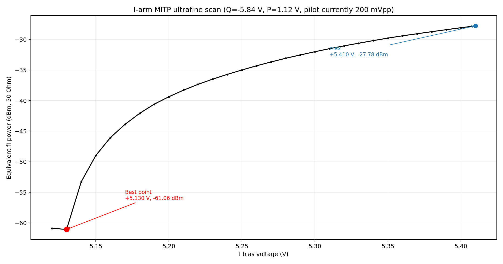
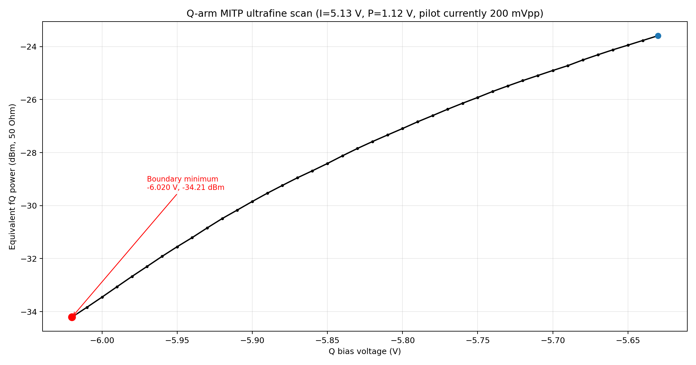
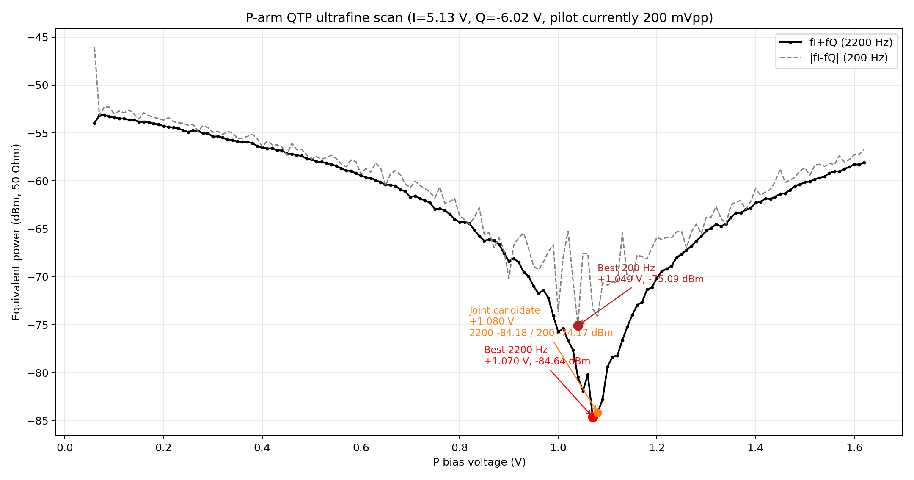

# 2026-04-24 DPMZM 阶段性收敛总结

本文档整理 2026-04-24 这轮 DPMZM 开环细扫 / 超细扫实验的阶段性结果。目标是沿着负 `Q` 分支，逐步逼近“最小-最小-正交”候选工作点，并把本轮有效扫描、无效扫描、当前候选点和未完全闭合的问题统一记录下来。

## 一句话结论

截至本轮实验结束，我们已经拿到一组很强的阶段性候选点：

- `I = +5.130 V`
- `Q = -6.020 V`
- `P = +1.070 V`

但需要保留一个重要注记：

- 最后一次 `Q-MITP` 超细扫的最小点落在扫描窗口左边界 `Q=-6.020 V`
- 这意味着 `Q` 的真实最优点有可能还在更负的方向
- 所以这组点目前更适合表述为“阶段性最优候选点”，而不是最终无疑义的收敛终点

## 实验条件

| 项目 | 数值 / 状态 |
|---|---|
| 模式 | DPMZM 开环扫描 |
| 导频来源 | `onboard` |
| 导频输出 | `continuous` |
| 导频频率 | `fI = 1000 Hz`, `fQ = 1200 Hz` |
| 导频幅度 | 本文档涉及的 2026-04-24 扫描实际均为 `200 mVpp` |
| 串口 | `COM9`, `115200` |
| 扫描输出 | `metrics` |
| 主要判据 | `MITP` 看 `fI` 或 `fQ`；`QTP` 主看 `2200 Hz`，并参考 `200 Hz` |

补充说明：

- 第一组 `P-QTP` 细扫的 CSV 文件名里仍然写着 `400mVpp`，但板上实际状态是 `200 mVpp`，后续分析均按实际状态记录。
- 本轮扫描已经基于之前修正过的频点映射和采样率问题进行，不再是旧版“频点盯错”的结果。

## 当前阶段结论

### 1. 已经实现的阶段性胜利

- `I / Q / P` 三路偏压确实可以通过交替细扫逐步收敛，而不是完全漂移或不可重复。
- `P-QTP` 的 `200 Hz` 与 `2200 Hz` 现在已经能够在同一小窗口内出现共同谷底。
- `I-MITP` 和 `Q-MITP` 都能扫出尖锐谷底，说明系统不再处在“测不准”的阶段。

### 2. 当前最强候选工作点

按本轮最后一次有效设置，当前候选点为：

- `I = +5.130 V`
- `Q = -6.020 V`
- `P = +1.070 V`

其中：

- `P=+1.070 V` 是按 `QTP` 主判据 `2200 Hz` 最小值自动设定的
- 如果按 `200 Hz` 和 `2200 Hz` 联合平衡，`P≈+1.080 V` 也很值得保留

### 3. 还没彻底闭合的问题

- `Q` 的最后一次超细扫最小点在左边界，说明窗口还不够靠左
- 下一轮如果要把这条负 `Q` 分支彻底坐实，优先建议补扫更负的 `Q` 小窗口

## 收敛过程总表

| 步骤 | 施加条件 | 执行动作 | 结果 | 数据 |
|---|---|---|---|---|
| 1 | `I=+5.4 V, Q=-5.9 V` | `dpmzm scan qtp p 0.2 2.2 0.02 6` | `2200 Hz` 最小在 `P=+1.36 V, -85.96 dBm`；`200 Hz` 最小在 `P=+1.32 V, -80.42 dBm`；联合候选约 `P≈+1.32 V` | [CSV](raw/2026-04-24-stage-summary/2026-04-24_100813_Sweep_P_QTP_I5p4_Q-5p9_finescan_0p2_to_2p2_step0p02_400mVpp_metrics.csv) |
| 2 | `Q=-5.9 V, P=+1.36 V` | `dpmzm scan mitp i 4.4 6.4 0.02 6` | `I=+5.64 V, fI=-55.17 dBm` | [CSV](raw/2026-04-24-stage-summary/2026-04-24_101153_Sweep_I_MITP_Q-5p9_P1p36_finescan_4p4_to_6p4_step0p02_metrics.csv) |
| 3 | `I=+5.64 V, P=+1.36 V` | `dpmzm scan mitp q -6.9 -4.9 0.02 6` | `Q=-6.24 V, fQ=-58.56 dBm` | [CSV](raw/2026-04-24-stage-summary/2026-04-24_101731_Sweep_Q_MITP_I5p64_P1p36_finescan_m6p9_to_m4p9_step0p02_metrics.csv) |
| 4 | `I=+5.64 V, Q=-6.24 V` | `dpmzm scan qtp p 0.2 2.2 0.02 6` | `2200 Hz` 最小在 `P=+1.10 V, -88.12 dBm`；`200 Hz` 最小在 `P=+1.16 V, -83.34 dBm`；联合候选约 `P≈+1.10 V` | [CSV](raw/2026-04-24-stage-summary/2026-04-24_102036_Sweep_P_QTP_I5p64_Q-6p24_finescan_0p2_to_2p2_step0p02_metrics.csv) |
| 5 | `Q=-6.24 V, P=+1.10 V` | `dpmzm scan mitp i 4.64 6.64 0.02 6` | `I=+5.32 V, fI=-63.25 dBm` | [CSV](raw/2026-04-24-stage-summary/2026-04-24_111401_Sweep_I_MITP_Q-6p24_P1p10_finescan_4p64_to_6p64_step0p02_metrics.csv) |
| 6 | `I=+5.32 V, P=+1.10 V` | `dpmzm scan mitp q -7.24 -5.24 0.02 6` | `Q=-5.84 V, fQ=-59.05 dBm` | [CSV](raw/2026-04-24-stage-summary/2026-04-24_111732_Sweep_Q_MITP_I5p32_P1p10_finescan_m7p24_to_m5p24_step0p02_metrics.csv) |
| 7 | `I=+5.32 V, Q=-5.84 V` | `dpmzm scan qtp p 0.1 2.1 0.02 6` | `2200 Hz` 最小在 `P=+1.12 V, -86.49 dBm`；`200 Hz` 最小在 `P=+1.10 V, -78.80 dBm`；联合候选约 `P≈+1.10 V` | [CSV](raw/2026-04-24-stage-summary/2026-04-24_112051_Sweep_P_QTP_I5p32_Q-5p84_finescan_0p1_to_2p1_step0p02_metrics.csv) |
| 8 | `Q=-5.84 V, P=+1.12 V` | `dpmzm scan mitp i 5.120 5.420 0.01 6`，之后执行 `dpmzm set bias i 5.130` | `I=+5.130 V, fI=-61.06 dBm` | [CSV](raw/2026-04-24-stage-summary/2026-04-24_112937_Sweep_I_MITP_Q-5p84_P1p12_ultrafine_5p120_to_5p420_step0p01_metrics.csv) |
| 9 | `I=+5.130 V, P=+1.12 V` | `dpmzm scan mitp q -6.020 -5.620 0.01 6`，之后执行 `dpmzm set bias q -6.020` | 窗口内最小点落在边界 `Q=-6.020 V, fQ=-34.21 dBm`；提示真实谷底可能还在更负方向 | [CSV](raw/2026-04-24-stage-summary/2026-04-24_113747_Sweep_Q_MITP_I5p13_P1p12_ultrafine_retry_m6p02_to_m5p62_step0p01_metrics.csv) |
| 10 | `I=+5.130 V, Q=-6.020 V` | `dpmzm scan qtp p 0.060 1.620 0.01 6`，之后执行 `dpmzm set bias p 1.070` | `2200 Hz` 最小在 `P=+1.070 V, -84.64 dBm`；`200 Hz` 最小在 `P=+1.040 V, -75.09 dBm`；联合候选约 `P≈+1.080 V` | [CSV](raw/2026-04-24-stage-summary/2026-04-24_114420_Sweep_P_QTP_I5p13_Q-6p02_ultrafine_0p060_to_1p620_step0p01_metrics.csv) |

## 无效数据说明

本轮有一次 `Q-MITP` 超细扫结果被明确判定为无效，未纳入上表：

- 无效时间戳：`2026-04-24_113549`
- 原因：前一次宽范围 `Q` 扫描在板上未真正结束，串口重连后读到了旧扫描尾段数据
- 表现：返回数据跑到了正 `Q` 区间，和本次命令指定的负 `Q` 小窗口明显不一致

这个问题说明一件很重要的实验经验：

- 串口关闭不等于板上扫描立即终止
- 如果前一次扫描被中断，后续抓到的第一段数据必须先核对 `scan start` 日志和首末电压范围，不能直接信

## 关键图像

### 1. 第一轮 P-QTP 细扫：把 `P` 从 `1.3~1.4 V` 区域找出来

### 2. 第一轮 I-MITP 细扫：把 `I` 收到 `+5.64 V`

### 3. 第一轮 Q-MITP 细扫：把负 `Q` 分支收到 `-6.24 V`

### 4. 第二轮 P-QTP 细扫：共同谷底明显移到 `1.1 V` 左右

### 5. 第二轮 I-MITP 细扫：`I` 再次收缩到 `+5.32 V`

### 6. 第二轮 Q-MITP 细扫：`Q` 从 `-6.24 V` 回拉到 `-5.84 V`

### 7. 第二轮 P-QTP 细扫：`P` 稳定在 `1.10~1.12 V`

### 8. I 超细扫：把 `I` 最终压到 `+5.130 V`

### 9. Q 超细扫：最小点落到左边界 `-6.020 V`

### 10. 最后一轮 P 超细扫：按主判据把 `P` 定到 `+1.070 V`

## 本轮实验得到的几个经验

### 1. 三路偏压强耦合，必须交替收敛

本轮最直接的现象是：

- `P` 一改，`I` 的 MITP 会变
- `I` 一改，`Q` 的 MITP 会变
- `Q` 一改，`P` 的 QTP 谷底又会轻微移动

所以不能把 `I / Q / P` 看成三路互不相关的独立标定量。

### 2. `QTP` 最好同时看 `2200 Hz` 和 `200 Hz`

如果只盯 `2200 Hz`，容易把 `P` 设到一个单指标更深、但联合并不最稳的位置；本轮结果表明：

- `P=+1.070 V` 更符合主判据 `2200 Hz`
- `P≈+1.080 V` 更接近 `200 Hz` 与 `2200 Hz` 的联合平衡

### 3. 超细扫时要记住固件不一定包含终点

例如 `0.01 V` 步进的 `I-MITP` 超细扫里，固件实际返回的是：

- `5.120000` 到 `5.410007`

而不是命令文本里的终点 `5.420`。这意味着以后做超细窗口设计时，边界要额外留一点冗余。

## 下一步建议

如果继续沿当前负 `Q` 分支推进，建议顺序如下：

1. 以 `I=+5.130 V, P=+1.070 V` 固定
2. 再向更负方向补一轮 `Q-MITP` 超细扫
3. 根据新的 `Q` 点，再做一次超细 `P-QTP`
4. 最后再回扫一次窄窗口 `I-MITP`

也就是说，当前最值得优先确认的不是 `I`，也不是 `P`，而是：

- `Q=-6.020 V` 是否只是窗口边界内最小
- 真正的 `Q` 全局局部谷底是否在更负一点的位置

## 当前可直接引用的阶段性结果

如需在后续实验记录中引用，本轮可以先使用如下表述：

> 在 2026-04-24 的 DPMZM 开环细扫实验中，沿负 `Q` 分支迭代后，系统收敛到一组强阶段性候选工作点：`I=+5.130 V, Q=-6.020 V, P=+1.070 V`。其中 `P` 已在 `QTP` 主判据下取得明显深谷，`I` 已通过超细扫稳定到 `+5.130 V`，而 `Q` 的最后一次超细扫最小点落在左边界，提示其最优点仍需向更负方向补充确认。
