# 2026-04-28 DPMZM 自动粗扫 + 自动细扫验证总结

> 状态：阶段性通过  
> 目标：验证 `dpmzm auto coarse` 后继续执行 `dpmzm auto fine`，能否自动收敛到可信的最小-最小-正交候选点。  
> 本轮结论：自动流程完整跑通，最终偏压点通过光功率计观察后大概率正确，可以认为第二版自动细扫已经完成第一轮上板验证。

---

## 1. 一句话结论

本轮自动流程成功完成：

```text
dpmzm auto coarse
dpmzm auto fine
```

最终固件自动应用的偏压为：

```text
I = +5.600 V
Q = -6.300 V
P = +1.520 V
```

从光功率计观察，这个点大概率是正确的。这说明当前自动粗扫 + 自动细扫得到的 RF 谷底点，已经能和实际光功率工作状态相互印证。这里先记录为定性确认；后续如果要写论文或正式报告，建议同时记录光功率计的数值、单位、量程和时间戳。

---

## 2. 实验条件

| 项目 | 设置 |
|---|---|
| 日期 | `2026-04-28` |
| 串口 | `COM9`, `115200` |
| 数据标签 | `2026-04-28_152630_auto_coarse_then_fine` |
| 导频来源 | `onboard` |
| 导频状态 | `pilot-open on` |
| 扫描输出 | `metrics` |
| 粗扫步进 | `0.1 V` |
| 宽窗细化 | `center +/- 2.0 V`, `step = 0.05 V` |
| 小窗口细扫 | `step = 0.01 V` |
| 总段数 | `11` 段 |
| 运行结果 | `coarse_done=True`, `fine_done=True`, `failed=False` |
| 运行耗时 | 约 `392 s` |

---

## 3. 数据文件

原始串口日志与解析结果已经保存在仓库文档目录：

| 文件 | 说明 |
|---|---|
| [summary](raw/2026-04-28-auto-coarse-fine/2026-04-28_152630_auto_coarse_then_fine_summary.txt) | 本轮自动扫描汇总 |
| [serial log](raw/2026-04-28-auto-coarse-fine/2026-04-28_152630_auto_coarse_then_fine_serial.log) | 完整串口日志 |
| [all segments csv](raw/2026-04-28-auto-coarse-fine/2026-04-28_152630_auto_coarse_then_fine_all_segments_metrics.csv) | 所有扫描点合并 CSV |

每一段扫描也保存了独立 CSV，位于：

```text
docs/scans/raw/2026-04-28-auto-coarse-fine/
```

对应图片保存于：

```text
docs/scans/assets/2026-04-28-auto-coarse-fine/
```

---

## 4. 自动流程结果总表

| 段落 | 阶段 | 目标 | 点数 | 自动选点 | 指标 |
|---|---|---|---:|---:|---:|
| 01 | `SCAN_I_MATP` | `I` | 181 | `+7.800 V` | `-39.71 dBm` |
| 02 | `SCAN_Q_MATP` | `Q` | 181 | `+2.000 V` | `-34.50 dBm` |
| 03 | `SCAN_P_QTP` | `P` | 181 | `+2.800 V` | `-65.01 dBm` |
| 04 | `SCAN_I_MITP` | `I` | 181 | `+4.500 V` | `-40.77 dBm` |
| 05 | `SCAN_Q_MITP` | `Q` | 181 | `-5.800 V` | `-46.31 dBm` |
| 06 | `FINE_SCAN_P_WIDE` | `P` | 81 | `+1.500 V` | `-71.89 dBm` |
| 07 | `FINE_SCAN_P_FINE` | `P` | 121 | `+1.520 V` | `-74.07 dBm` |
| 08 | `FINE_SCAN_I_WIDE` | `I` | 80 | `+5.650 V` | `-49.19 dBm` |
| 09 | `FINE_SCAN_I_FINE` | `I` | 120 | `+5.600 V` | `-69.32 dBm` |
| 10 | `FINE_SCAN_Q_WIDE` | `Q` | 80 | `-6.300 V` | `-50.70 dBm` |
| 11 | `FINE_SCAN_Q_FINE` | `Q` | 120 | `-6.300 V` | `-74.29 dBm` |

本轮没有触发贴边扩窗：

```text
P expanded = no
I expanded = no
Q expanded = no
```

---

## 5. 过程理解

本轮流程可以理解为：

1. 粗扫阶段先找到可用的 `I/Q/P` 初始点。
2. `P` 先做宽窗细化，再做小窗口细扫，把 QTP 从粗扫的 `+2.800 V` 拉到 `+1.520 V`。
3. `I` 随后做宽窗细化和小窗口细扫，把 MITP 从粗扫的 `+4.500 V` 拉到 `+5.600 V`。
4. `Q` 最后做宽窗细化和小窗口细扫，把 MITP 从粗扫的 `-5.800 V` 拉到 `-6.300 V`。
5. 由于 `P/I/Q` 三路强耦合，细扫后的位置相比粗扫明显变化，这是符合我们前几天手动开环扫描经验的。

这次最重要的进展不是某一个单独数值，而是自动流程已经复现了人工“先粗后细、逐路收敛”的逻辑。

---

## 6. 光功率计验证结论

你从光功率计看到的状态表明，最终点：

```text
I = +5.600 V
Q = -6.300 V
P = +1.520 V
```

大概率就是正确的最小-最小-正交候选点。

这件事很关键，因为它把两个观测链路对上了：

- 固件链路：通过 ADC + Goertzel 找到 `fI`、`fQ`、`fI+fQ` 的谷底。
- 光路链路：通过光功率计确认最终偏压点确实落在合理的光学工作状态。

所以本轮可以视为第二版自动细扫的阶段性胜利。

保留一点谨慎：当前还不是长期闭环锁定，只是开环自动找点已经可信。下一步仍然需要做重复性验证、温漂观察和闭环小扰动误差构造。

---

## 7. 关键曲线

### 7.1 粗扫 I-MATP

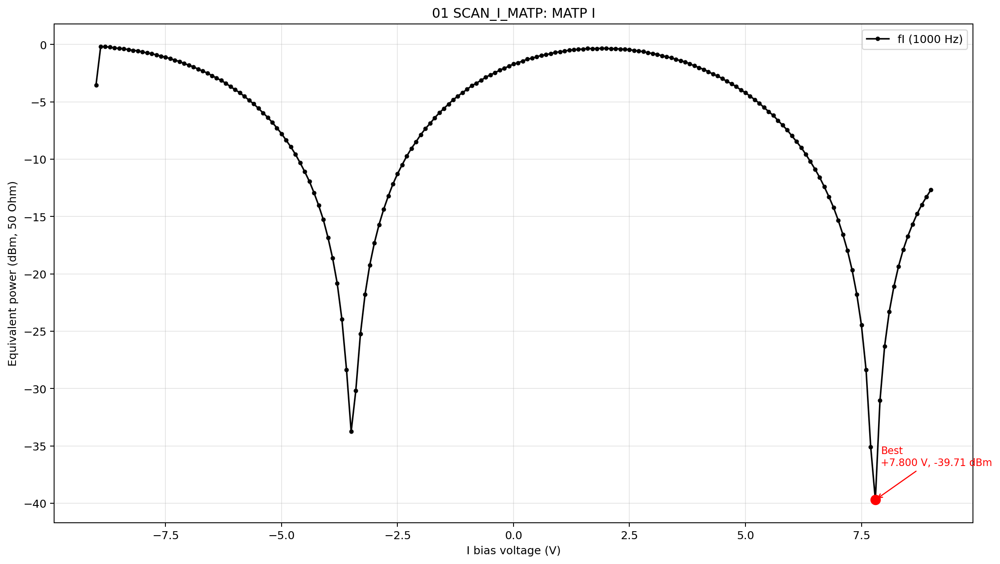

### 7.2 粗扫 Q-MATP

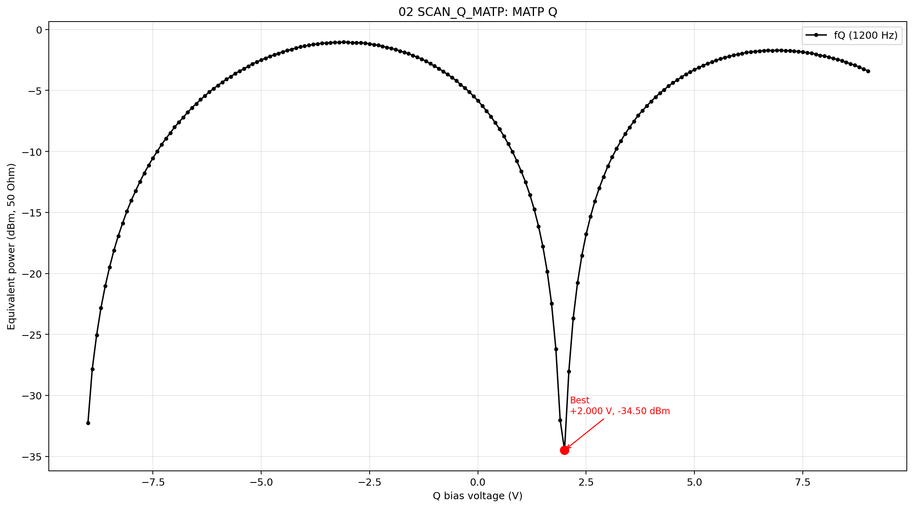

### 7.3 粗扫 P-QTP

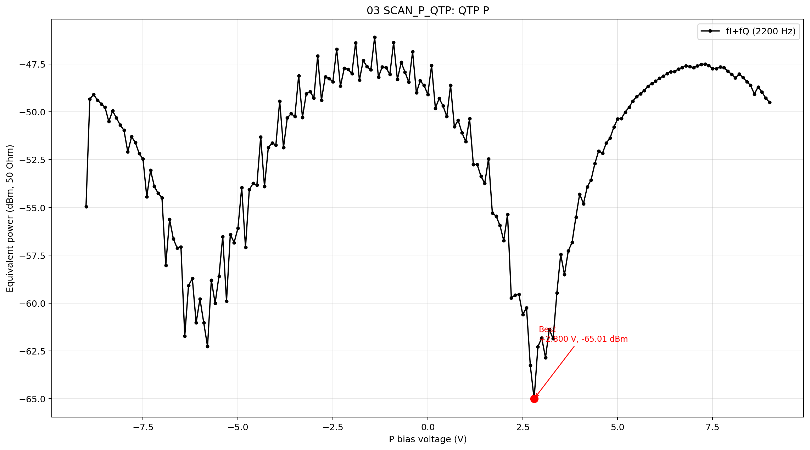

### 7.4 粗扫 I-MITP

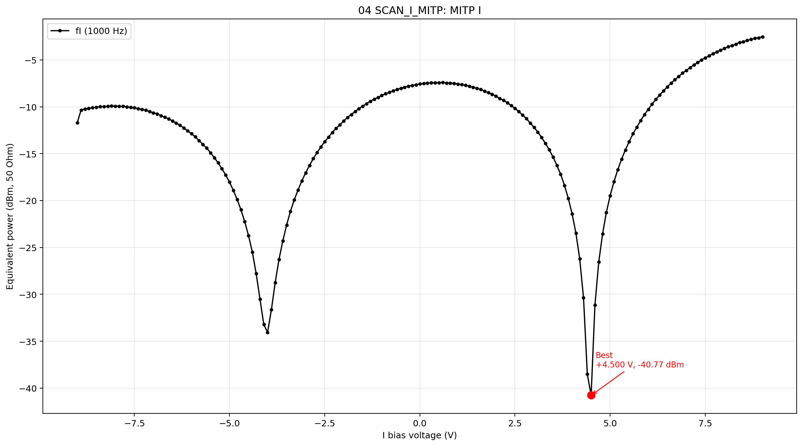

### 7.5 粗扫 Q-MITP

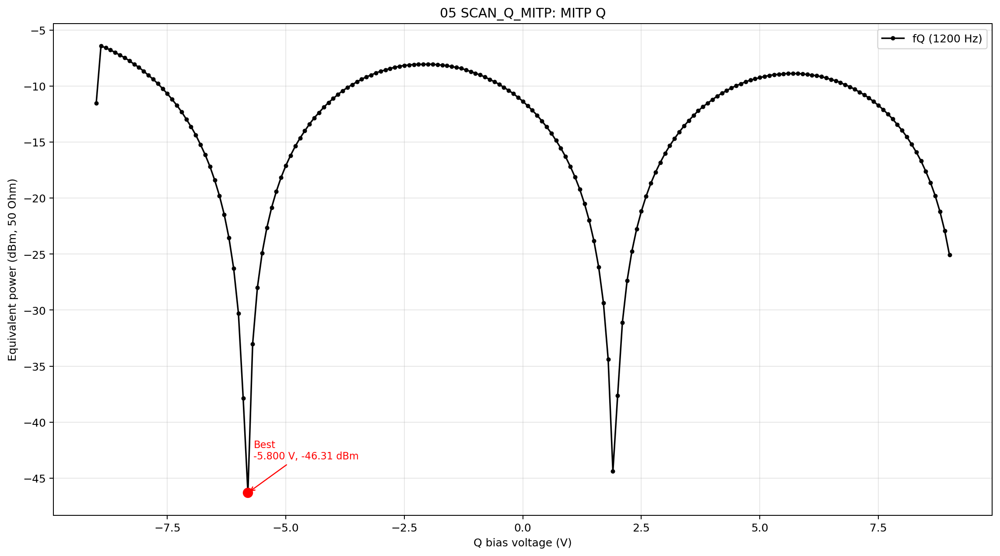

### 7.6 P 宽窗细化

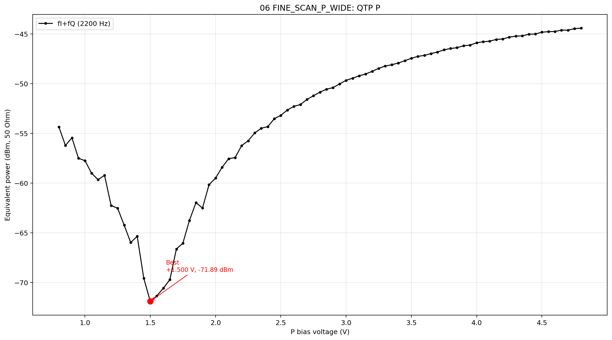

### 7.7 P 小窗口细扫

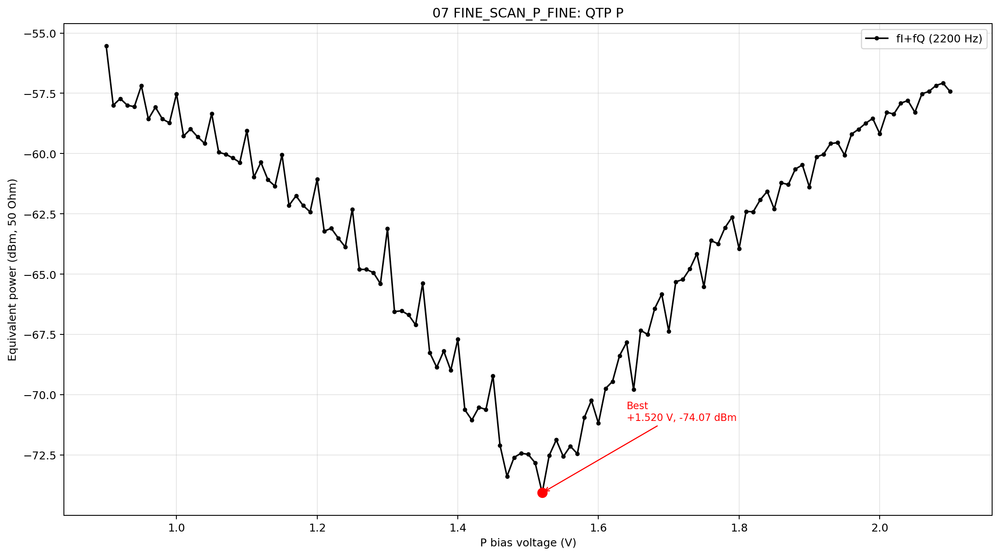

### 7.8 I 宽窗细化

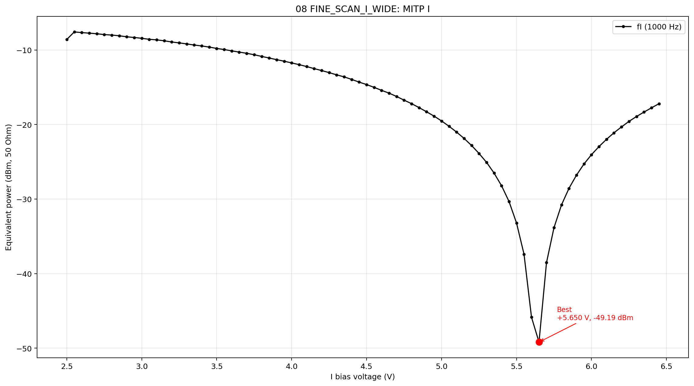

### 7.9 I 小窗口细扫

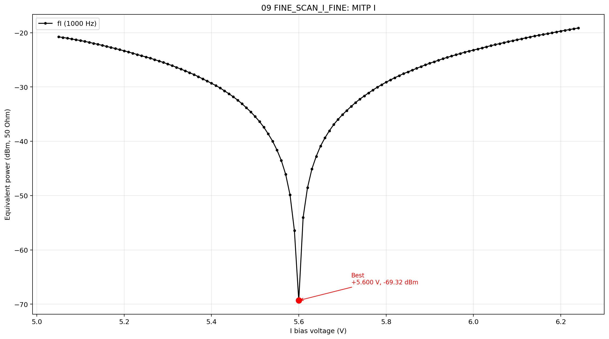

### 7.10 Q 宽窗细化

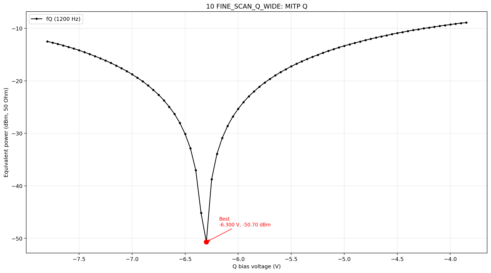

### 7.11 Q 小窗口细扫

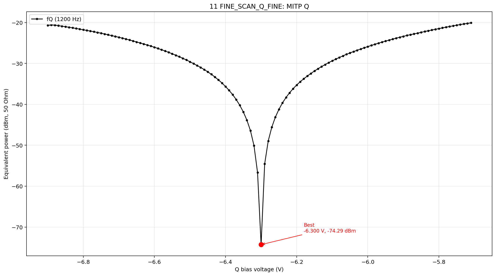

---

## 8. 当前阶段判断

可以认为已经完成：

- V1：自动粗扫。
- V2：自动细扫第一版主流程。
- 上板验证：自动粗扫 + 自动细扫能跑通。
- 人工验证：最终点经过光功率计观察后大概率正确。

还没有完成：

- 多次重复扫描的统计稳定性。
- 记录光功率计数值并和 RF 指标做定量对应。
- 自动细扫后的二次小窗口迭代。
- 闭环小扰动有符号误差。
- 长时间漂移与温漂验证。

---

## 9. 下一步建议

下一轮建议不要马上大改算法，而是先做重复性验证：

1. 复位或重新上电后，再跑一次 `dpmzm auto coarse` + `dpmzm auto fine`。
2. 记录最终 `I/Q/P` 与本轮是否接近。
3. 同时记录光功率计读数。
4. 如果结果稳定，再进入自动细扫二次迭代或闭环小扰动阶段。

如果下一轮最终点仍接近：

```text
I ~= +5.6 V
Q ~= -6.3 V
P ~= +1.5 V
```

那我们就有很强的理由说：当前 DPMZM 自动找点链路已经从“能跑”进入“可信”的阶段。
